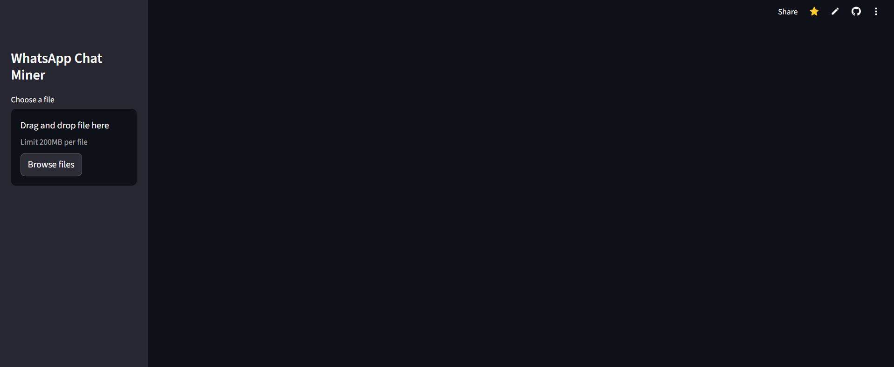

# 📊 WhatsApp Chat Analyzer
A **Streamlit web app** to analyze WhatsApp chat exports. It generates insights, statistics, and visualizations such as message counts, timelines, word clouds, most active users, and emoji usage.

🔗 **Live Demo:** [WhatsApp Chat Analyzer](https://whatsapp-chat-analyzerrohit-nhqknfv2o5cjncqb8jf8da.streamlit.app/)

---

## 📸 Preview


---

## 🚀 Features
* 📈 **Basic Stats**: Total messages, words, media shared, and links shared.
* 🗓 **Timelines**:
  * Monthly chat trends
  * Daily activity patterns
* 📅 **Activity Maps**:
  * Busiest days & months
  * Weekly heatmap activity
* 👥 **Most Active Users** (group chats only).
* ☁️ **WordCloud** of frequent words (with stopword removal for Hinglish).
* 🔤 **Most Common Words** with frequency bar chart.
* 😀 **Emoji Analysis** (counts + pie chart visualization).

---

## 📂 Project Structure
```
.
├── app.py               # Main Streamlit app
├── helper.py            # Helper functions (stats, plots, wordcloud, etc.)
├── preprocessor.py      # Chat preprocessing and parsing
├── requirements.txt     # Dependencies
├── stop_hinglish.txt    # Custom stopwords for Hinglish filtering
└── Appscreenshort.png   # Application screenshot
```

---

## ⚙️ Installation
Clone this repository and install the dependencies:
```bash
git clone https://github.com/your-username/whatsapp-chat-analyzer.git
cd whatsapp-chat-analyzer
pip install -r requirements.txt
```

---

## ▶️ Usage
1. Export a WhatsApp chat from your phone (without media).
   * In WhatsApp: **More → Export Chat → Without Media**
   * Save the exported `.txt` file.
2. Run the Streamlit app:
```bash
streamlit run app.py
```
3. Upload your chat `.txt` file via the sidebar.
4. Select either **Overall** (group-level analysis) or a **specific user** for detailed analysis.

---

## 📦 Requirements
Dependencies are listed in `requirements.txt`:
* `streamlit`
* `matplotlib`
* `seaborn`
* `urlextract`
* `wordcloud`
* `pandas`
* `emoji`

Install them with:
```bash
pip install -r requirements.txt
```

---

## 📝 Notes
* The app supports **Hinglish stopword removal** using `stop_hinglish.txt`.
* Works best with **WhatsApp's default export format** (`.txt`).
* Emojis are extracted and counted with the `emoji` package.

---

## 🙌 Acknowledgements
* Built with [Streamlit](https://streamlit.io/)
* Inspired by analyzing WhatsApp conversations
